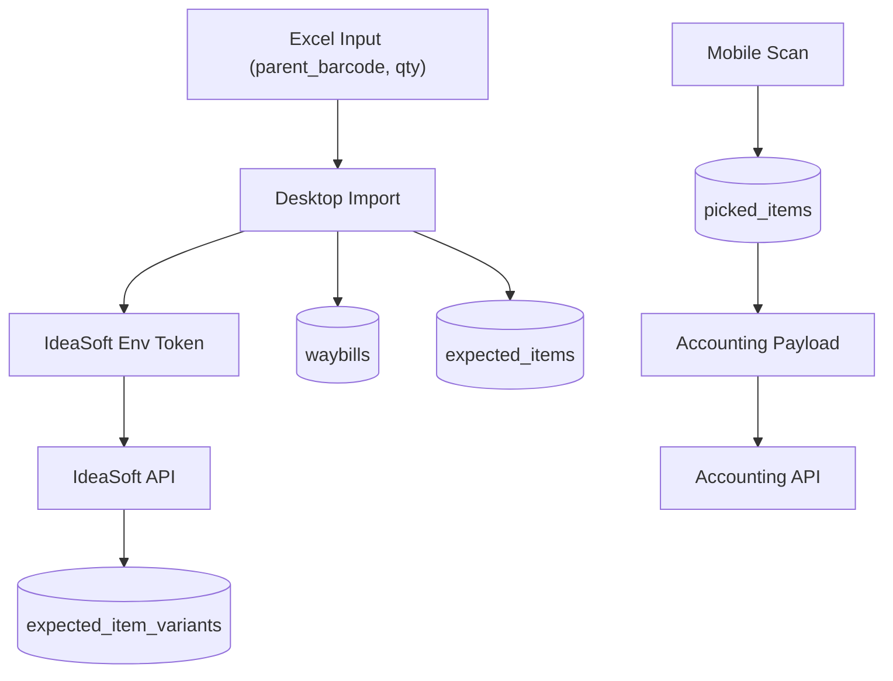

# Kurumsal İrsaliye ve Depo Otomasyonu — Nihai Revize Plan

Bu plan, açık soruların tamamı cevaplandıktan sonra güncellenmiş nihai sürümdür. Hedef mimari: tek repo içinde `mobile` + `desktop` + `backend`, masaüstünde `Electron + React + TypeScript`, backend'de Supabase.

## 1) Kapsam ve Kesin Kararlar

- Desktop importer Excel okur, IdeaSoft ile varyant enrichment yapar, Supabase'e yazar.
- Mobilde tek picker kuralı vardır; aynı irsaliyede aynı anda bir kişi çalışır.
- Mobil scan gerçek varyant barkodu ile yapılır; `picked_items` gerçek barkodu saklar.
- Muhasebeye gönderimde parent toplam değil, okutulan gerçek varyant barkod + adet gönderilir.

### Netleşen Operasyonel Kararlar

- IdeaSoft erişimi: `preconfigured_env_token`
- Enrichment cache: `manual_refresh_only`
- Enrichment hata davranışı: `retry_then_skip` (warning ile devam)
- Varyant bulunamazsa: `parent == variant`
- Picked aggregation: `upsert_single_row`
- Picked unique/upsert key: `(waybill_id, actual_variant_barcode)`
- Prefix eşleşmede minimum karakter kuralı: yok
- Kilit devral/kaldır: `admin_only`
- Lock audit: `detailed_log_with_reason`
- Muhasebe payload: sadece `actual_variant_barcode + quantity`
- Muhasebe retry: 3 deneme, exponential backoff

## 2) Mimari ve Veri Akışı



## 3) Issue Sırası

```text
Issue 1 -> Issue 2 -> Issue 3 -> Issue 4 -> Issue 4.5 -> Issue 5 -> Issue 6 -> Issue 7
      -> Issue 8 -> Issue 9 -> Issue 10 -> Issue 11 -> Issue 12 -> Issue 13
```

---

## Issue 2: Supabase Şeması, RLS ve Realtime (Revize)

**Yapılacaklar**
- [ ] `waybills`: `locked_by_user_id`, `locked_at` alanlarını koru.
- [ ] `expected_items`: `parent_barcode`, `total_expected_qty`, `enrichment_status`.
- [ ] `expected_item_variants`: `expected_item_id`, `variant_barcode`, `variant_options`, `ideasoft_product_id`.
- [ ] `picked_items`: `parent_expected_item_id`, `actual_variant_barcode`, `quantity`.
- [ ] `picked_items` unique/upsert key: `(waybill_id, actual_variant_barcode)`.
- [ ] `lock_waybill` / `release_waybill` RPC.
- [ ] Admin için `force_unlock_waybill` (veya eşdeğeri) admin-only RPC.
- [ ] Lock audit tablosu (veya mevcut audit yapısı) zorunlu `reason` alanı ile.

**Teknik Notlar**
- RLS: `authenticated` rolü + `auth.uid()`.
- `force_unlock` yalnızca admin role claim ile.

**DoD**
- [ ] Tek picker lock kuralı çalışır.
- [ ] Admin lock takeover reason olmadan yapılamaz.

---

## Issue 4: Excel Parse (Revize)

**Yapılacaklar**
- [ ] Header mapping: `irsaliye_no`, `parent_barcode`, `urun_adi`, `adet`.
- [ ] `parent_barcode` zorunlu validasyon.
- [ ] Parse sonucu: `validRows`, `invalidRows`, `warnings`, `source`.

---

## Issue 4.5: IdeaSoft Variant Enrichment (Yeni)

**Yapılacaklar**
- [ ] Desktop IdeaSoft client: env token ile çağrı.
- [ ] `enrichVariants(parentBarcode)` (`q[barcode_start]`, gerekirse `q[barcode_cont]`).
- [ ] Cache politikası: `manual_refresh_only` (kullanıcı aksiyonu ile yenile).
- [ ] Hata politikası: 3 retry değil, enrichment için kısa retry + `enrichment_failed` işaretle, importu durdurma.
- [ ] Varyant bulunamazsa `parent == variant` fallback üret.

**Referans**
- Mevcut yaklaşım: [lib/features/product_check/data/datasources/product_remote_datasource.dart](lib/features/product_check/data/datasources/product_remote_datasource.dart)

**DoD**
- [ ] Varyant bulunan parent için `expected_item_variants` üretilir.
- [ ] Varyant bulunamayan parent fallback ile importtan düşmez.

---

## Issue 5: Onay Ekranı (Revize)

**Yapılacaklar**
- [ ] Parent kalem + varyant alt liste (accordion) göster.
- [ ] `enrichment_failed` satırlar için uyarı rozetleri.
- [ ] Warning onayıyla importa devam edebilme.

**DoD**
- [ ] Kullanıcı `enrichment_failed` satırları görüp onay vererek devam edebilir.

---

## Issue 6: Supabase Yazımı (Revize)

**Yazım sırası**
- [ ] `waybills` -> `expected_items` -> `expected_item_variants`

**Conflict anahtarları**
- [ ] `waybills(waybill_number)`
- [ ] `expected_items(waybill_id, parent_barcode)`
- [ ] `expected_item_variants(expected_item_id, variant_barcode)`

---

## Issue 7: Doğrulama Ekranı (Revize)

**Yapılacaklar**
- [ ] Parent + variant seviyesinde karşılaştırma.
- [ ] Eksik/çok varyant uyarı rozeti.

---

## Issue 9: Mobil Barkod Okutma (Revize)

**Eşleşme sırası**
1. `expected_item_variants.variant_barcode` exact
2. `expected_item_variants.variant_barcode` prefix
3. `expected_items.parent_barcode` prefix
4. manuel arama

**Yapılacaklar**
- [ ] Scan sonucu `picked_items.actual_variant_barcode` alanına gerçek kodu yaz.
- [ ] Upsert key: `(waybill_id, actual_variant_barcode)` ile quantity artır.
- [ ] Parent bağını `parent_expected_item_id` üzerinden sürdür.

**Referans**
- Prefix davranışı: [lib/features/product_check/domain/barcode_prefix_matcher.dart](lib/features/product_check/domain/barcode_prefix_matcher.dart)

---

## Issue 10: Realtime + Tamamlama (Revize)

**Yapılacaklar**
- [ ] `lock_waybill` ile girişte kilit al.
- [ ] Çıkış/tamamlama ile `release_waybill`.
- [ ] Admin-only lock takeover UI aksiyonu ekle.
- [ ] Lock takeover sırasında zorunlu `reason` alanı.

---

## Issue 12: Muhasebe Gateway (Revize)

**Payload modeli**

```ts
type AccountingLine = {
  parent_barcode: string;
  actual_variant_barcode: string;
  quantity: number;
};
```

**Yapılacaklar**
- [ ] Mock + REST adapter bu modele uyumlu.
- [ ] Retry politikası: 3 deneme, exponential backoff (1s, 2s, 4s).

---

## Issue 13: Muhasebe Gönderim (Revize)

**Yapılacaklar**
- [ ] Payload'u doğrudan `picked_items` verisinden üret.
- [ ] Aynı varyant barkod için tek satır upsert quantity değeri gönder.
- [ ] Başarısızlıkta otomatik 3 retry, sonra `failed`.
- [ ] `accounting_submissions.payload` içinde gönderilen varyant satırlarını sakla.

---

## 9) Karara Bağlanan Konular (v1)

| Konu | Karar |
|------|-------|
| IdeaSoft token | env token |
| Cache | manual refresh only |
| Enrichment failed | warning ile devam |
| Varyant yoksa | parent == variant |
| Picked key | waybill_id + actual_variant_barcode |
| Lock takeover | admin only + reason zorunlu |
| Muhasebe payload | actual_variant_barcode + quantity |
| Muhasebe retry | 3x exponential |

## 11) Netleşen Detay Kararları

1. IdeaSoft token kullanıcı oturumundan değil env'den alınır.
2. Enrichment cache otomatik TTL yerine manuel yenilemeyle yönetilir.
3. `enrichment_failed` satırlar importu bloklamaz, warning ile devam eder.
4. Parent barkod varyantsızsa fallback tek varyant kabul edilir.
5. Picked kayıtları `(waybill_id, actual_variant_barcode)` üzerinden birikir.
6. Prefix eşleşmede minimum karakter limiti yoktur.
7. Muhasebeye `variant_options` gönderilmez.
8. Kilit devral/kaldır admin ekranından gerekçeli yapılır.
