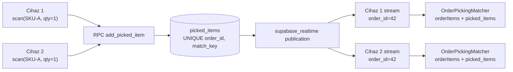

# Picking Feature — Realtime Order Picking Blueprint

Mavikalem Flutter app'i icin Supabase Realtime tabanli, cok-cihazli senkronize urun toplama (picking) altyapisi. Bu dokuman yalnizca planlama amaclidir; UI veya state management kodu yazilmayacak. Onaydan sonra Task 2 (SQL/RLS) ve Task 3-5 (domain/data) implemente edilecek.

## 0. Hedef ve Kisitlar

- **Hedef:** IdeaSoft'tan gelen `orderItems` listesini referans alarak, ayni `order_id` icin birden fazla cihazin (picker) ayni anda okuttugu urunlerin Supabase Realtime ile diger cihazlara aninda yansimasi.
- **Senkronizasyon birimi:** `order_id`. Picking_session yalnizca audit/etiketleme amacli; gercek state `picked_items` tablosundadir.
- **Conflict resolution:** ayni `order_id + match_key` icin tek satir; ayni urun tekrar okutuldugunda yeni satir acilmaz, `quantity` atomik olarak artirilir.
- **Auth:** Supabase Anonymous Sign-In; her cihaz kendi `auth.uid()`'sine sahip. RLS yalnizca `authenticated` rol kontrolu yapar; kullanici yetki/sahiplik kontrolu yok (cunku ayni order'i farkli pickerlar gormeli).
- **Gizlilik:** `SUPABASE_URL` ve `SUPABASE_ANON_KEY` `.env` dosyasindan okunur; service role key client'ta asla bulunmaz.
- **Mimari:** Clean Architecture + mevcut feature ayrimi. Yeni feature `lib/features/picking/` altinda izole edilir.
- **State management:** Mevcut Riverpod (DI) + flutter_bloc (presentation) yapisi korunur. Bu PR yalnizca domain + data + matching service uretir; presentation layer sonraki PR'da.
- **SOLID:** Repository interface domain'de, implementasyon data'da. Matching servisi saf (no IO) ve repository'den bagimsiz; testlenebilir.

## 1. Klasor Yapisi (`lib/features/picking/`)

```
lib/features/picking/
  domain/
    entities/
      picked_item.dart
      picking_session.dart
      picking_progress.dart            # toplam/tamam/eksik/fazla aggregate
    repositories/
      picking_repository.dart          # abstract interface
    services/
      order_picking_matcher.dart       # saf matching/aggregation
    usecases/
      start_picking_session.dart
      end_picking_session.dart
      add_picked_item.dart
      watch_picked_items.dart          # session bazli (spec uyumu)
      watch_order_picking_progress.dart # order bazli + matching combine
  data/
    datasources/
      supabase_picking_remote_datasource.dart
    models/
      picked_item_model.dart           # PickedItem extends + fromMap/toInsert
      picking_session_model.dart
    repositories/
      supabase_picking_repository_impl.dart
  # presentation/  --> Sonraki PR (UI + Bloc/Notifier)
```

Ek olarak core katmaninda:

```
lib/core/
  env/
    app_env.dart                       # flutter_dotenv okuma + SupabaseConfig
  supabase/
    supabase_client_provider.dart      # Riverpod Provider<SupabaseClient>
    device_id_provider.dart            # uuid + secure_storage ile kalici device id
```

Yeni dosyalar:

- [.env](.env) (gitignore'a eklenir; ornek `.env.example` repo'da kalabilir)
- [.env.example](.env.example)

## 2. Bagimliliklar

`pubspec.yaml` `dependencies:` altina eklenir:

- `supabase_flutter` (Supabase SDK + Realtime)
- `flutter_dotenv` (.env okuma)
- `uuid` (device_id ve session id fallback uretimi)

`flutter:` bloguna asset olarak `.env` eklenir:

```yaml
flutter:
  assets:
    - .env
```

`.gitignore`'a `/.env` eklenir; `.env.example` izlenir.

## 3. Supabase Setup Plani

1. Supabase projesi olusturulur (mevcut yoksa).
2. `auth.providers.anonymous` etkinlestirilir (Dashboard -> Authentication -> Providers -> Anonymous).
3. SQL editor uzerinde Bolum 4'teki DDL + RLS + RPC + realtime publication scriptleri sirayla calistirilir.
4. Anon public key `.env` dosyasinin `SUPABASE_ANON_KEY=` satirina, project URL `SUPABASE_URL=` satirina yazilir.
5. App acilirken `main.dart`'ta:
   - `await dotenv.load(fileName: '.env');`
   - `await Supabase.initialize(url: AppEnv.supabaseUrl, anonKey: AppEnv.supabaseAnonKey);`
   - `await Supabase.instance.client.auth.signInAnonymously();` (zaten anon session varsa idempotent)

`AppEnv` sinifi tum env okumalarini kapsuller; null/empty kontrolu yapar, eksikse `StateError` firlatir (fail-fast).

## 4. Database Schema, RLS, Realtime, RPC

Tum DDL idempotent yazilir (`if not exists`); `supabase/migrations/` altina dosya konabilir.

### 4.1 `picking_sessions`

```sql
create table if not exists public.picking_sessions (
  id              uuid primary key default gen_random_uuid(),
  order_id        bigint not null,
  picker_name     text   not null,
  device_id       text,
  supabase_user_id uuid not null default auth.uid(),
  status          text   not null default 'active'
                    check (status in ('active','completed','cancelled')),
  started_at      timestamptz not null default now(),
  ended_at        timestamptz,
  updated_at      timestamptz not null default now()
);

create index if not exists picking_sessions_order_status_idx
  on public.picking_sessions (order_id, status);

create index if not exists picking_sessions_started_at_idx
  on public.picking_sessions (started_at desc);
```

### 4.2 `picked_items`

`match_key` her satirda kanonik anahtar (uygulama tarafinda `sku` varsa `sku`, yoksa `barcode` ile doldurulur). Tekillik bunun uzerinden saglanir.

```sql
create table if not exists public.picked_items (
  id                uuid primary key default gen_random_uuid(),
  order_id          bigint not null,
  match_key         text   not null,
  sku               text,
  barcode           text,
  product_name      text   not null,
  quantity          integer not null default 0 check (quantity >= 0),
  last_session_id   uuid references public.picking_sessions(id) on delete set null,
  last_picker_name  text,
  last_device_id    text,
  created_at        timestamptz not null default now(),
  updated_at        timestamptz not null default now()
);

create unique index if not exists picked_items_order_match_uidx
  on public.picked_items (order_id, match_key);

create index if not exists picked_items_order_updated_idx
  on public.picked_items (order_id, updated_at desc);

create index if not exists picked_items_session_idx
  on public.picked_items (last_session_id);
```

### 4.3 `updated_at` trigger

```sql
create or replace function public.tg_set_updated_at()
returns trigger language plpgsql as $$
begin
  new.updated_at = now();
  return new;
end $$;

drop trigger if exists picking_sessions_set_updated_at on public.picking_sessions;
create trigger picking_sessions_set_updated_at
  before update on public.picking_sessions
  for each row execute function public.tg_set_updated_at();

drop trigger if exists picked_items_set_updated_at on public.picked_items;
create trigger picked_items_set_updated_at
  before update on public.picked_items
  for each row execute function public.tg_set_updated_at();
```

### 4.4 RLS

```sql
alter table public.picking_sessions enable row level security;
alter table public.picked_items     enable row level security;

-- picking_sessions: tum authenticated kullanicilar gorebilir, kendi adlarina insert eder.
create policy "picking_sessions_select_authenticated"
  on public.picking_sessions for select
  to authenticated
  using (true);

create policy "picking_sessions_insert_authenticated"
  on public.picking_sessions for insert
  to authenticated
  with check (supabase_user_id = auth.uid());

create policy "picking_sessions_update_own_or_any"
  on public.picking_sessions for update
  to authenticated
  using (true)
  with check (true);

-- picked_items: ortak veri; herkes okur, herkes yazar (uygulama tarafinda RPC ile).
create policy "picked_items_select_authenticated"
  on public.picked_items for select
  to authenticated
  using (true);

create policy "picked_items_insert_authenticated"
  on public.picked_items for insert
  to authenticated
  with check (true);

create policy "picked_items_update_authenticated"
  on public.picked_items for update
  to authenticated
  using (true)
  with check (true);

-- DELETE bilincli olarak kapali.
```

Anonim kullanicinin `authenticated` role'u Supabase Anonymous Sign-In sonrasi atanir; bu yuzden ayri `anon` policy'sine ihtiyac yok.

### 4.5 Realtime Publication

Supabase Realtime icin tablolarin `supabase_realtime` publication'ina dahil edilmesi gerekir.

```sql
alter publication supabase_realtime add table public.picking_sessions;
alter publication supabase_realtime add table public.picked_items;
```

(Idempotent calistirma icin once `drop`, sonra `add` yapilabilir veya `pg_publication_tables` ile kontrol edilebilir.)

### 4.6 Atomik Upsert RPC: `add_picked_item`

Quantity artirimi `.upsert()` ile native Postgres `INSERT ... ON CONFLICT DO UPDATE` uzerinden yapilamaz cunku set ifadesinde `quantity = picked_items.quantity + EXCLUDED.quantity` kalibi gerekir. Bu yuzden RPC fonksiyonu yazilir; client `rpc('add_picked_item', params: ...)` ile cagirir.

```sql
create or replace function public.add_picked_item(
  p_order_id       bigint,
  p_match_key      text,
  p_sku            text,
  p_barcode        text,
  p_product_name   text,
  p_quantity       integer,
  p_session_id     uuid,
  p_picker_name    text,
  p_device_id      text
) returns public.picked_items
language plpgsql
security invoker
as $$
declare
  v_row public.picked_items;
begin
  if p_quantity is null or p_quantity <= 0 then
    raise exception 'p_quantity must be > 0';
  end if;
  if p_match_key is null or length(trim(p_match_key)) = 0 then
    raise exception 'p_match_key required';
  end if;

  insert into public.picked_items (
    order_id, match_key, sku, barcode, product_name, quantity,
    last_session_id, last_picker_name, last_device_id
  ) values (
    p_order_id, p_match_key, nullif(p_sku, ''), nullif(p_barcode, ''),
    p_product_name, p_quantity,
    p_session_id, p_picker_name, p_device_id
  )
  on conflict (order_id, match_key) do update set
    quantity         = public.picked_items.quantity + excluded.quantity,
    sku              = coalesce(public.picked_items.sku, excluded.sku),
    barcode          = coalesce(public.picked_items.barcode, excluded.barcode),
    product_name     = excluded.product_name,
    last_session_id  = excluded.last_session_id,
    last_picker_name = excluded.last_picker_name,
    last_device_id   = excluded.last_device_id
  returning * into v_row;

  return v_row;
end $$;

grant execute on function public.add_picked_item(
  bigint, text, text, text, text, integer, uuid, text, text
) to authenticated;
```

Negatif quantity (geri alma) icin ayri bir RPC `decrement_picked_item` veya `set_picked_item_quantity` ileride eklenebilir; bu PR kapsami disinda.

## 5. Domain Layer

### 5.1 `PickedItem`

```dart
class PickedItem {
  final String id;
  final int orderId;
  final String matchKey;
  final String? sku;
  final String? barcode;
  final String productName;
  final int quantity;
  final String? lastSessionId;
  final String? lastPickerName;
  final String? lastDeviceId;
  final DateTime createdAt;
  final DateTime updatedAt;
}
```

`Equatable` veya elle `==`/`hashCode` (mevcut entity konvansiyonu — `OrderEntity` plain class). Tutarlilik icin `OrderEntity` gibi plain immutable; `Equatable` opsiyonel.

### 5.2 `PickingSession`

```dart
enum PickingSessionStatus { active, completed, cancelled }

class PickingSession {
  final String id;
  final int orderId;
  final String pickerName;
  final String? deviceId;
  final PickingSessionStatus status;
  final DateTime startedAt;
  final DateTime? endedAt;
}
```

### 5.3 `PickingProgress` (matching ciktisi)

```dart
class PickedLineProgress {
  final OrderItemEntity orderItem;     // IdeaSoft ref
  final int requiredQuantity;          // orderItem.quantity.ceil()
  final int pickedQuantity;            // picked_items aggregate
  final PickedLineStatus status;       // pending/partial/completed/excess
  final PickedItem? matched;           // picked_items satiri (varsa)
}

enum PickedLineStatus { pending, partial, completed, excess }

class PickingProgress {
  final int orderId;
  final List<PickedLineProgress> lines;          // siparisteki tum kalemler
  final List<PickedItem> extraScans;             // siparis disi okutmalar
  final int totalRequired;
  final int totalPicked;                         // siparise dahil olanlardan
  final double ratio;                            // totalPicked / totalRequired
  final bool isComplete;                         // tum lines completed && extras bos
}
```

### 5.4 `PickingRepository`

Spec'teki uc metoda ek olarak gerekli minimum metotlar eklenir; spec metotlari isim/imza olarak korunur.

```dart
abstract interface class PickingRepository {
  Future<String> startPickingSession(int orderId, String pickerName);

  Future<void> addPickedItem(
    String sessionId,
    String sku,
    String productName,
    int quantity,
  );

  Stream<List<PickedItem>> watchPickedItems(String sessionId);

  // --- Order-based realtime sync icin ek metodlar (clarification gereksinimi) ---

  Future<void> endPickingSession(String sessionId, {bool cancelled = false});

  /// `sku` bos ise `barcode` match_key olarak kullanilir.
  Future<void> addPickedItemByCode(
    String sessionId, {
    required int orderId,
    String? sku,
    String? barcode,
    required String productName,
    required int quantity,
  });

  /// Tum cihazlarin paylastigi tek dogruluk kaynagi: order_id bazli akis.
  Stream<List<PickedItem>> watchPickedItemsForOrder(int orderId);
}
```

Notlar:

- `addPickedItem(sessionId, sku, productName, quantity)` icin order_id, session row'undan lookup edilir (cache + cold path Supabase'den fetch). match_key = sku; bos sku ile cagrilirsa `ArgumentError`.
- `watchPickedItems(String sessionId)`: spec ile uyum icin korunur ama uygulamada rahmetli olur — UI `watchPickedItemsForOrder` kullanir; bu metod yalnizca bir oturum filtreli akis ister (audit/log gibi).

## 6. Data Layer

### 6.1 `SupabasePickingRemoteDataSource`

Tum Supabase API cagrilarini barindirir. Surekli `SupabaseClient` ile calisir; modeller arasi donusum yapmaz (datasource map dondurur, repository model'e cevirir) — basitlik icin doğrudan model donusumu de yapilabilir; mevcut `OrdersRemoteDataSource` desenine uyulur (datasource model dondurur).

Sorumluluklar:

- `Future<PickingSessionModel> insertSession({orderId, pickerName, deviceId})` → `from('picking_sessions').insert({...}).select().single()`.
- `Future<PickingSessionModel?> fetchSessionById(String sessionId)`.
- `Future<void> updateSessionStatus(String sessionId, PickingSessionStatus newStatus)`.
- `Future<PickedItemModel> rpcAddPickedItem({...})` → `client.rpc('add_picked_item', params: {...}).select().single()`.
- `Stream<List<PickedItemModel>> streamPickedItemsByOrder(int orderId)` → `client.from('picked_items').stream(primaryKey: ['id']).eq('order_id', orderId).order('updated_at')`.
- `Stream<List<PickedItemModel>> streamPickedItemsBySession(String sessionId)` → `last_session_id` filtresiyle ayni cagri (oturum filtreli akis).

### 6.2 `SupabasePickingRepositoryImpl`

Repository interface implementasyonu; datasource cagrilarini map'leyip domain entity dondurur. Iceride kucuk bir `_sessionCache: Map<String, PickingSession>` tutulur; `addPickedItem`'da order_id bilgisini sessionId'den hizli almak icin.

`addPickedItem` flow'u:

```text
sessionId, sku, productName, quantity
  -> session = _resolveSession(sessionId) (cache or fetch)
  -> matchKey = sku (trim, non-empty kontrolu)
  -> rpcAddPickedItem(order_id=session.orderId, match_key=matchKey,
                      sku=sku, barcode=null, product_name=productName,
                      quantity=quantity, session_id=sessionId,
                      picker_name=session.pickerName,
                      device_id=session.deviceId)
```

`addPickedItemByCode` flow'u: matchKey = sku?.trim() varsa sku, yoksa barcode?.trim(); ikisi de yoksa `ArgumentError`.

`watchPickedItemsForOrder(int orderId)`:

```dart
return _ds.streamPickedItemsByOrder(orderId).map(
  (rows) => rows.map(PickedItemMapper.fromModel).toList(growable: false),
);
```

### 6.3 Modeller

`PickedItemModel extends PickedItem` ile `factory PickedItemModel.fromMap(Map<String, dynamic>)` ve `Map<String, dynamic> toInsert()` metodlari. `OrderResponseModel` desenine uyumlu.

## 7. Realtime Stream Logic



Notlar:

- `supabase_flutter` SDK'sinin `.stream()` API'si initial snapshot + INSERT/UPDATE/DELETE event'lerini birlestirir; tek bir `Stream<List<Map>>` dondurur.
- `eq('order_id', orderId)` server-side filtre uygular; gereksiz veri gelmez.
- `order('updated_at')` ile UI'da kararli sira saglanir (matching servisi zaten aggregate yapacagi icin sira UI tarafi icin onemli).
- Connection drop sonrasi SDK otomatik reconnect; aradaki kayitlar reconnect anindaki snapshot ile telafi edilir.

## 8. Matching Service (`order_picking_matcher.dart`)

Saf, IO'siz bir servis. Input: `List<OrderItemEntity>` (IdeaSoft) + `List<PickedItem>` (Supabase). Output: `PickingProgress`.

Sozlesme:

```dart
final class OrderPickingMatcher {
  const OrderPickingMatcher._();

  static PickingProgress combine({
    required int orderId,
    required List<OrderItemEntity> orderItems,
    required List<PickedItem> pickedItems,
  });
}
```

Algoritma:

1. `pickedByKey: Map<String, PickedItem>` — `pickedItems`'i `match_key` (normalize) ile indexle.
2. `orderItemsByKey`: her `OrderItemEntity` icin tercih sirasi `stockCode` -> `barcode` (mevcut [order_pack_matcher.dart](lib/features/orders/domain/order_pack_matcher.dart) `_normalize` fonksiyonu ile uyumlu): bosluksuz lower-case; bos ise `null`.
3. Her `OrderItemEntity` icin satir progress'i:
   - `requiredQty = orderItem.quantity.ceil()` (mevcut quantity double; picked_items int).
   - Lookup: once stockCode normalize ile, yoksa barcode normalize ile `pickedByKey`'de ara.
   - `pickedQty = matched?.quantity ?? 0`.
   - Status:
     - `pending` if pickedQty == 0
     - `partial` if 0 < pickedQty < requiredQty
     - `completed` if pickedQty == requiredQty
     - `excess` if pickedQty > requiredQty
4. `extraScans`: `pickedItems` icinde hicbir orderItem'a eslesemeyen kayitlar — operatöre uyari icin.
5. Aggregate:
   - `totalRequired = sum(requiredQty)`
   - `totalPicked = sum(min(pickedQty, requiredQty))` (excess'i ratio'ya saymaz)
   - `ratio = totalRequired == 0 ? 0 : totalPicked / totalRequired`
   - `isComplete = lines.every(status == completed) && extraScans.isEmpty`

Mevcut [order_pack_matcher.dart](lib/features/orders/domain/order_pack_matcher.dart)'daki `_normalize` ve `codeVariants` fonksiyonlari kullanilmaz — picking icin dogrudan ham `match_key` esitligine guveniriz cunku canonical anahtar zaten yazma sirasinda secilmis durumda. Ileride ihtiyac olursa `codeVariants` ile fuzzy matching opsiyonel layer olarak eklenebilir.

## 9. Use Cases

- `StartPickingSession(repository)`: `call({orderId, pickerName})` -> `Future<String>`.
- `EndPickingSession(repository)`: `call(sessionId, {cancelled = false})`.
- `AddPickedItem(repository)`: `call({sessionId, sku, productName, quantity})` -> `Future<void>`.
- `WatchPickedItemsForOrder(repository)`: `call(int orderId)` -> `Stream<List<PickedItem>>`.
- `WatchOrderPickingProgress(repository)`: orderItems + watchPickedItemsForOrder'i combineLatest ile birlestirir; her emit'de `OrderPickingMatcher.combine(...)` cagirip `Stream<PickingProgress>` dondurur. RxDart `Rx.combineLatest2` kullanilir (mevcut `rxdart` bagimliligi var).

```dart
Stream<PickingProgress> call({
  required int orderId,
  required Stream<List<OrderItemEntity>> orderItemsStream, // veya Future, tek seferlik fetch sonrasi BehaviorSubject
}) {
  final picked$ = _repository.watchPickedItemsForOrder(orderId);
  return Rx.combineLatest2(orderItemsStream, picked$, (items, picks) =>
      OrderPickingMatcher.combine(orderId: orderId, orderItems: items, pickedItems: picks));
}
```

## 10. DI / Riverpod (Sadece Provider Skeleton)

`lib/features/picking/presentation/` UI'i sonraki PR'da gelecek olsa da, repository'nin hayatta olmasi icin Riverpod provider'lari bu PR'da minimal taniticak (tasinma kolay olsun diye `lib/features/picking/data/providers/picking_providers.dart` veya `domain` altinda degil, `core/supabase/...` ile yan yana tutulabilir):

```dart
final supabaseClientProvider = Provider<SupabaseClient>((_) => Supabase.instance.client);

final pickingRemoteDataSourceProvider = Provider<SupabasePickingRemoteDataSource>((ref) {
  return SupabasePickingRemoteDataSource(ref.watch(supabaseClientProvider));
});

final pickingRepositoryProvider = Provider<PickingRepository>((ref) {
  return SupabasePickingRepositoryImpl(ref.watch(pickingRemoteDataSourceProvider));
});

final startPickingSessionUseCaseProvider = Provider((ref) =>
    StartPickingSession(ref.watch(pickingRepositoryProvider)));
// ... digerleri benzer.
```

`AppEnv` ve Supabase init `main.dart`'a eklenir (zaten Riverpod `ProviderScope` mevcut).

## 11. Hata Yonetimi ve Kenar Durumlari

- Network kesintisi: `supabase_flutter` SDK reconnect; UI loading state'lerini PickingProgress'e degil, ust katman bloc'a bagimli tutariz (sonraki PR).
- RPC validation hatalari (`p_quantity <= 0`, `p_match_key empty`): `PostgrestException` -> repository `ArgumentError` veya `StateError`'a sarmalar.
- `addPickedItem`'a sku/match_key bos gelirse domain seviyesinde reddedilir (UI scan validasyonu mevcut [order_pack_matcher.dart](lib/features/orders/domain/order_pack_matcher.dart) ile zaten yapildi).
- Anonim auth basarisiz olursa `Supabase.initialize` sonrasi `signInAnonymously` retry; uc deneme sonrasi initialization hata dondurur.
- Tablolarin biri publication'da degilse stream sessizce calisir ama event almaz; deployment kontrol scriptine eklenir.

## 12. Test Plani (Yalnizca Domain/Matcher icin)

Bu PR'da:

- `test/picking/order_picking_matcher_test.dart`:
  - bos pickedItems -> tum lines pending, ratio 0
  - tek satir partial / completed / excess
  - extraScan tespiti (siparis disi sku)
  - normalize: bosluk/buyukharf farkliliklarinda eslesme
- `test/picking/picking_repository_contract_test.dart` (fake datasource): `addPickedItem` sku bos ise hata, oncelik sku>barcode.

UI/state-management testleri kapsam disinda.

## 13. Step-by-Step Uygulama Sirasi

1. `.env.example`, `.env`, `.gitignore` guncellemesi; `pubspec.yaml`'a `supabase_flutter`, `flutter_dotenv`, `uuid` eklenir; `pub get`.
2. `lib/core/env/app_env.dart` ve `lib/core/supabase/supabase_client_provider.dart` olusturulur. `main.dart`'a `dotenv.load + Supabase.initialize + signInAnonymously` eklenir.
3. Supabase Dashboard'da Bolum 4'teki SQL bloklari calistirilir (tablolar, indexler, RLS, trigger, RPC, publication).
4. `lib/features/picking/domain/` altinda entity'ler + repository interface + matching service + use case'ler.
5. `lib/features/picking/data/` altinda model + datasource + repository impl.
6. Riverpod provider'lari (Bolum 10).
7. Domain testleri (Bolum 12).
8. Manuel akis dogrulamasi: iki cihazda ayni order icin scan -> RPC -> realtime stream -> matcher; presentation katmani gelmeden once basit bir CLI/widget harness ile dogrulama.

## 14. Bu PR Disinda

- UI / `PickingPage` ve Bloc/Notifier: ayri PR.
- Negatif quantity / silme akisi (`decrement_picked_item`).
- Picker yetkilendirme (uid bazli RLS / membership tablosu).
- Offline queue (offline iken scan biriktirme): bu PR'da scope disi; `addPickedItem` su an online gerektirir.
- IdeaSoft `OrderItemEntity` icin `copyWith` veya degisiklik yok; mevcut entity dokunulmadan kullanilir.
