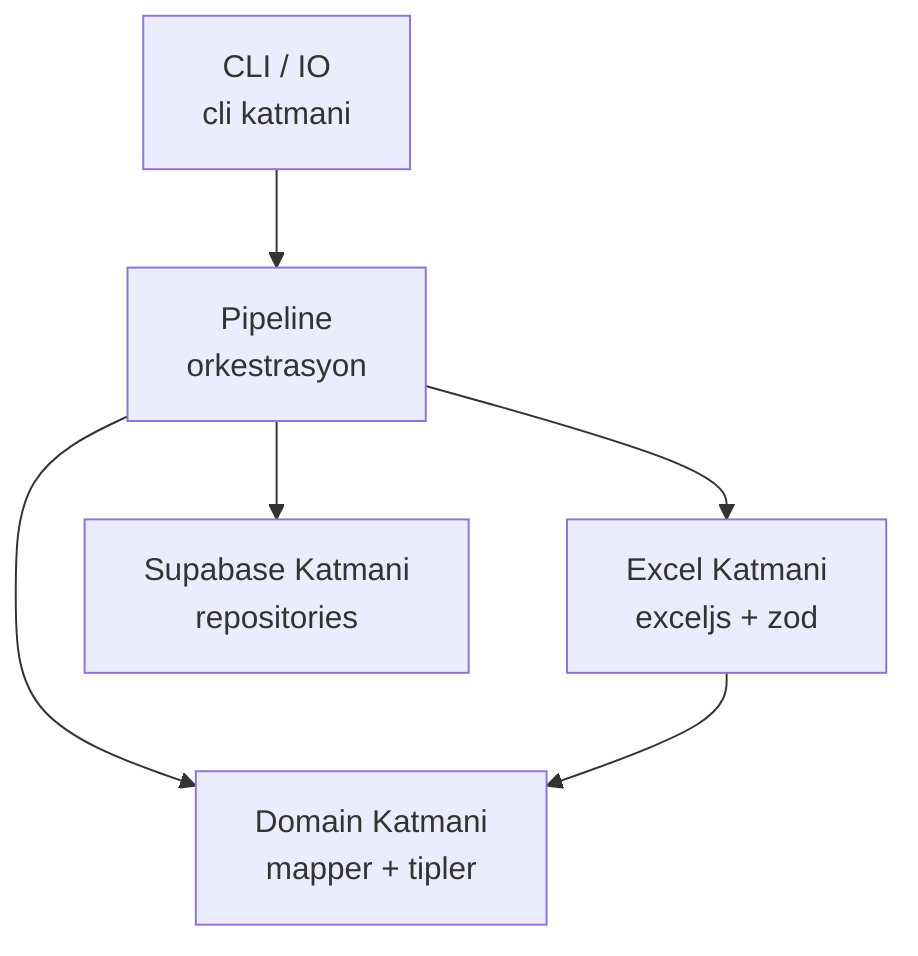

# Waybill Importer — Geliştirme Planı

Node.js/TypeScript ile Excel → Supabase toplu veri aktarımı yapan 5 katmanlı CLI aracının 6 bağımsız ve sıralı issue'ya bölünmüş geliştirme planı. Her issue ayrı commit edilebilir ve test edilebilir.

## Proje Konumu

`mavikalem/tools/waybill-importer/`

Mevcut Flutter projesinden tamamen izole; ortak bağımlılık yok.

## Mimari Özet

Her katman tek yönde bagimlidir; ustteki alttakini bilmez.

---

## Issue 1: Project Scaffold & Configuration

**Description:**

Projenin iskelet yapisi ve calisma ortami kurulur. Hicbir is mantigi yazilmaz; sadece dizin yapisi, paket konfigurasyon dosyalari ve `src/config/env.ts` ile `src/index.ts` stublar olusturulur.

Olusturulacak dosyalar:
- `tools/waybill-importer/package.json` — scripts: `dev`, `build`, `start`; dependencies: `typescript@^5`, `tsx@^4`, `@types/node@^22`, `dotenv@^16`, `commander@^12`
- `tools/waybill-importer/tsconfig.json` — `target: ES2022`, `module: NodeNext`, `moduleResolution: NodeNext`, `strict: true`, `outDir: dist`
- `tools/waybill-importer/.env.example` — `SUPABASE_URL=`, `SUPABASE_SERVICE_KEY=`
- `tools/waybill-importer/.gitignore` — `node_modules/`, `dist/`, `.env`
- `tools/waybill-importer/src/config/env.ts` — `dotenv.config()` + `SUPABASE_URL` ve `SUPABASE_SERVICE_KEY` dogrulayan; eksikse `process.exit(1)` ile net hata mesaji basan fonksiyon
- `tools/waybill-importer/src/index.ts` — `commander` ile `--file`, `--dry-run`, `--chunk-size` (default 500) parametrelerini tanimlayan minimal entrypoint; su an icin sadece aldigini konsola yazsin

**Test/Commit kriteri:** `cd tools/waybill-importer && npm install && npx tsx src/index.ts --help` komutu yardim metnini eksiksiz gostermelidir.

**Commit mesaji onerisi:** `feat(waybill-importer): project scaffold and CLI entrypoint`

---

**Agent Prompt:**

> `mavikalem/tools/waybill-importer/` dizinini sifirdan olustur. Bu dizin mevcut Flutter projesinden tamamen bagimsiz bir Node.js/TypeScript CLI araci olacak. Olusturulacaklar:
>
> 1. `package.json`: name `waybill-importer`, scripts `dev: tsx src/index.ts`, `build: tsc`, `start: node dist/index.js`. Dependencies: `dotenv@^16`, `commander@^12`. DevDependencies: `typescript@^5`, `tsx@^4`, `@types/node@^22`.
> 2. `tsconfig.json`: `target: ES2022`, `module: NodeNext`, `moduleResolution: NodeNext`, `rootDir: src`, `outDir: dist`, `strict: true`, `esModuleInterop: true`.
> 3. `.env.example`: iki satir: `SUPABASE_URL=` ve `SUPABASE_SERVICE_KEY=`.
> 4. `.gitignore`: `node_modules/`, `dist/`, `.env`.
> 5. `src/config/env.ts`: `dotenv.config()` cagirir, `SUPABASE_URL` ve `SUPABASE_SERVICE_KEY` env degiskenlerini okur; biri eksikse hangi key eksik oldugunu belirten mesajla `process.exit(1)` cagirir. Deger varsa `{ supabaseUrl, supabaseServiceKey }` objesi return eder.
> 6. `src/index.ts`: `commander` ile `--file <path>` (required), `--dry-run` (flag, default false), `--chunk-size <number>` (optional, default 500) parametrelerini tanimlar. Su an icin `console.log` ile aldigini yazsin, is mantigi yok. Lint hatasi olmamali.

---

## Issue 2: Excel Layer — Parser & Validator

**Description:**

Ham veri katmani. `exceljs` ile Excel dosyasini okur; `zod` ile her satiri dogrular. Bu katman Supabase'i ve domain'i bilmez; sadece ham tipler uretir.

Olusturulacak dosyalar:
- `src/excel/types.ts` — `RawWaybillRow` ve `RawExpectedItemRow` interfacelari (string/number/undefined alanlari olan ham tipler); `ValidationError` { row: number; field: string; message: string } tipi
- `src/excel/excel_parser.ts` — `parseExcel(filePath: string): Promise<{ waybillRows: unknown[]; itemRows: unknown[] }>` fonksiyonu. Birden fazla sheet senaryosu: Sheet 1 irsaliye baslik verileri, Sheet 2 kalem verileri. Sheet yoksa anlasilir hata firlatir.
- `src/excel/row_validator.ts` — `validateWaybillRows` ve `validateExpectedItemRows` fonksiyonlari; `zod` schema ile her satiri dogrular; `{ valid: ValidatedRow[]; errors: ValidationError[] }` doner

Paketler: `exceljs@^4`, `zod@^3`

Alanlar (varsayilan, plan sonundaki sorulara gore degisebilir):
- Waybill sheet: `waybill_number` (text, required), `supplier_name` (text, optional), `invoice_number` (text, optional)
- Items sheet: `waybill_number` (text, required — join icin), `barcode` (text, required), `sku` (text, required), `product_name` (text, required), `variant_label` (text, optional), `expected_qty` (number, required, min 1)

**Test/Commit kriteri:** `npx tsx src/index.ts --file ornek.xlsx --dry-run` calistirinca parse edilen satir sayisi ve varsa validation hatalari konsola basilmalidir. Hicbir Supabase cagrisi yapilmamaldir.

**Commit mesaji onerisi:** `feat(waybill-importer): excel parser and zod row validator`

---

**Agent Prompt:**

> `tools/waybill-importer/src/excel/` altinda uc dosya olustur. Proje `NodeNext` module resolution kullanmaktadir; import'larda `.js` uzantisi gerekir.
>
> 1. `types.ts`: `RawWaybillRow` interface (waybill_number, supplier_name?, invoice_number? — hepsi unknown), `RawExpectedItemRow` interface (waybill_number, barcode, sku, product_name, variant_label?, expected_qty — hepsi unknown), `ValidationError` interface { rowIndex: number; field: string; message: string }.
>
> 2. `excel_parser.ts`: `exceljs` import et. `parseExcel(filePath: string): Promise<{ waybillRows: unknown[]; itemRows: unknown[] }>` fonksiyonu yaz. Workbook'u readonly ac. Ilk sheet waybill baslik verileri (header satirini atla), ikinci sheet kalem verileri (header satirini atla). Her satiri plain nesneye cevir: kolon basliklarini key, hucre degerini value yap. Sheet bulunamazsa anlasilir Error firlatsin.
>
> 3. `row_validator.ts`: `zod` kullan. `waybillRowSchema` tanimla: waybill_number string().min(1), supplier_name string().optional(), invoice_number string().optional(). `expectedItemRowSchema` tanimla: waybill_number string().min(1), barcode string().min(1), sku string().min(1), product_name string().min(1), variant_label string().optional(), expected_qty number().int().min(1). Her schema icin `validateRows<T>(rows: unknown[], schema): { valid: T[]; errors: ValidationError[] }` generic fonksiyonu yaz; her satiri ayri parse et, basarisiz olanlari errors'a ekle.
>
> Son olarak `src/index.ts` icindeki `--dry-run` dalina excel parse ve validate adimlarini bagla; sonuclari konsola yazdir. Linter hatasi olmamali.

---

## Issue 3: Domain Layer — Types & Mapper

**Description:**

Is mantigi katmani. Ham (validated) satiri Supabase'e yazilacak domain objesine donusturur. Pure fonksiyonlar; IO yok, yan etki yok, test edilmesi trivial.

Olusturulacak dosyalar:
- `src/domain/types.ts` — `Waybill` ve `ExpectedItem` interfacelari (Supabase'e yazilacak alanlar tam olarak burada tanimli)
- `src/domain/mapper.ts` — `toWaybill(row: ValidatedWaybillRow): Waybill` ve `toExpectedItem(row: ValidatedExpectedItemRow, waybillId: string): ExpectedItem` pure fonksiyonlari

`Waybill` alanlari: `waybill_number: string`, `supplier_name: string | null`, `invoice_number: string | null`, `status: 'open'` (sabit default)

`ExpectedItem` alanlari: `waybill_id: string`, `barcode: string`, `sku: string`, `product_name: string`, `variant_label: string | null`, `expected_qty: number`

Not: `id` ve `created_at` Supabase tarafindan uretilecegi icin mapper'da yer almaz.

**Test/Commit kriteri:** Mapper dosyasinin yanina `mapper.test.ts` yazilmali (paket: `vitest@^2`). Mock bir `ValidatedWaybillRow` girerek cikan `Waybill`'in beklenen alanlara sahip oldugu dogrulanmalidir.

**Commit mesaji onerisi:** `feat(waybill-importer): domain types and row mapper with unit tests`

---

**Agent Prompt:**

> `tools/waybill-importer/src/domain/` altinda dosyalari olustur.
>
> 1. `types.ts`: `Waybill` interface: `waybill_number: string`, `supplier_name: string | null`, `invoice_number: string | null`, `status: 'open'`. `ExpectedItem` interface: `waybill_id: string`, `barcode: string`, `sku: string`, `product_name: string`, `variant_label: string | null`, `expected_qty: number`.
>
> 2. `mapper.ts`: `toWaybill(row: ValidatedWaybillRow): Waybill` — status'u her zaman 'open' set et, null konversiyon yap. `toExpectedItem(row: ValidatedExpectedItemRow, waybillId: string): ExpectedItem` — waybill_id parametreden gelir.
>
> 3. `mapper.test.ts`: `vitest` kullan. `toWaybill` icin: supplier_name eksik oldugunda null donmeli, waybill_number dogru aktarilmali. `toExpectedItem` icin: waybill_id parametreden dogru gelir, expected_qty integer olarak korunur, variant_label opsiyonel calismalidir. `devDependencies`'e `vitest@^2` ekle, `package.json` scripts'e `"test": "vitest run"` ekle. Testleri `npm test` ile calistir ve gectigini dogrula.

---

## Issue 4: Supabase Persistence Layer

**Description:**

Persistence katmani ve chunk yardimci fonksiyonu. Mevcut `picked_items` SQL sema pattern'ini (`uuid PK`, unique index, `upsert onConflict`) birebir izler. `service_role` key kullanilir (RLS bypass); bu arac sadece yerel/admin ortamda calisacagi icin guvenlidir.

Olusturulacak dosyalar:
- `src/pipeline/chunk_util.ts` — `chunk<T>(arr: T[], size: number): T[][]` pure fonksiyonu
- `src/supabase/client.ts` — `createSupabaseClient()` — `env.ts`'ten aldigini `createClient(url, serviceKey)` ile dondurur
- `src/supabase/waybill_repository.ts` — `upsertWaybills(waybills: Waybill[], opts: { chunkSize: number; dryRun: boolean }): Promise<UpsertResult>` — `onConflict: 'waybill_number'`, chunk'lara boler, her chunk'tan sonra `inserted` sayacini arttirir; `dryRun` true ise Supabase cagrisi yapmaz sadece log basar
- `src/supabase/expected_items_repository.ts` — ayni pattern; `onConflict: 'waybill_id,sku'`; `UpsertResult`: `{ inserted: number; errors: RepositoryError[] }`

Paketler: `@supabase/supabase-js@^2`

**Test/Commit kriteri:** `--dry-run` modunda calistirinca "DRY RUN: 12 waybills would be inserted" benzeri log gorunmeli; hicbir Supabase cagrisi yapilmamalidir (`SUPABASE_SERVICE_KEY` env olmadan da calisabilmeli).

**Commit mesaji onerisi:** `feat(waybill-importer): supabase persistence layer with chunk upsert`

---

**Agent Prompt:**

> `tools/waybill-importer/src/` icinde iki alt dizin doldur.
>
> `src/pipeline/chunk_util.ts`: `export function chunk<T>(arr: T[], size: number): T[][]` — size <= 0 ise Error firlatsin.
>
> `src/supabase/client.ts`: `@supabase/supabase-js` import et. `createSupabaseClient()` fonksiyonu `env.ts`'den aldigini kullanarak `createClient(supabaseUrl, supabaseServiceKey)` dondurecek. `dependencies`'e `@supabase/supabase-js@^2` ekle.
>
> `src/supabase/waybill_repository.ts`: `UpsertResult` interface: `{ inserted: number; errors: Array<{ item: unknown; message: string }> }`. `upsertWaybills(client, waybills: Waybill[], opts: { chunkSize: number; dryRun: boolean }): Promise<UpsertResult>`. `chunk_util` ile parcala. Her chunk icin: `dryRun` true ise `console.log('[DRY RUN] waybills chunk:', chunk.length)` yazdir; false ise `client.from('waybills').upsert(chunk, { onConflict: 'waybill_number' })` cagir, Supabase error varsa `errors`'a ekle. Toplam `inserted` say.
>
> `src/supabase/expected_items_repository.ts`: ayni pattern; `onConflict: 'waybill_id,sku'`.
>
> Linter hatasi olmamali, tum import'lar `.js` uzantili olmali.

---

## Issue 5: Pipeline Orchestration

**Description:**

Tum katmanlari sirayla cagirir: parse → validate → map → upsert. `EventEmitter` ile progress event'leri yayar; UI katmani bu event'leri dinleyerek progress bar guncelleyecektir. Pipeline'in kendisi konsola hicbir sey yazmaz — bu ayrim CLI katmaninin sorumlulugundadir.

Olusturulacak dosyalar:
- `src/pipeline/import_pipeline.ts` — `ImportPipeline extends EventEmitter`; `run(opts: PipelineOptions): Promise<PipelineResult>` metodu

Emit edilen event'ler:
- `'parse:done'` — `{ waybillCount, itemCount }`
- `'validate:done'` — `{ validCount, errorCount }`
- `'upsert:progress'` — `{ entity: 'waybills' | 'items', done: number, total: number }`
- `'done'` — `PipelineResult`

`PipelineResult`: `{ waybillsInserted, itemsInserted, validationErrors: ValidationError[], repositoryErrors }`

Upsert asamasinda waybill'lar once insert edilir; `expected_items` icin `waybill_id` Supabase'den donen `id` ile eslestirilir (waybill_number → id map'i).

**Test/Commit kriteri:** Ornek bir xlsx ile `--dry-run` modunda calistirildiginda tum event'ler ates edilmeli ve `PipelineResult` dogru sayilari icermelidir.

**Commit mesaji onerisi:** `feat(waybill-importer): import pipeline orchestration with EventEmitter`

---

**Agent Prompt:**

> `tools/waybill-importer/src/pipeline/import_pipeline.ts` dosyasini yaz.
>
> `ImportPipeline extends EventEmitter` sinifi olacak. `run(opts: { filePath: string; chunkSize: number; dryRun: boolean }): Promise<PipelineResult>` metodu:
> 1. `parseExcel(filePath)` cagir → `'parse:done'` emit et
> 2. `validateWaybillRows` ve `validateExpectedItemRows` cagir → `'validate:done'` emit et
> 3. `toWaybill` ile hepsini map et
> 4. `upsertWaybills` cagir; her chunk bittikce `'upsert:progress'` emit et `{ entity: 'waybills', done, total }`
> 5. `dryRun` false ise: upsert donen `waybills` kayitlarinda `waybill_number → id` map'i olustur (Supabase'den `select id, waybill_number` ile cek). `dryRun` true ise waybill_number'lari gecici UUID'lerle eslestir (test icin).
> 6. `toExpectedItem` ile item'lari map et (waybill_id = az once bulunan id)
> 7. `upsertExpectedItems` cagir; `'upsert:progress'` emit et `{ entity: 'items', done, total }`
> 8. `'done'` emit et, `PipelineResult` dondur
>
> `PipelineResult`: `{ waybillsInserted: number; itemsInserted: number; validationErrors: ValidationError[]; repositoryErrors: Array<{ entity: string; message: string }> }`. Linter hatasi olmamali.

---

## Issue 6: CLI Interface & Full Integration

**Description:**

Son katman: progress bar, error log yazimi ve `index.ts`'in tamamlanmasi. Bu issue bittikten sonra arac uc-uca calisir hale gelir.

Olusturulacak/tamamlanacak dosyalar:
- `src/cli/progress_reporter.ts` — `cli-progress` ile `MultiBar`; pipeline'in `'upsert:progress'` event'ini dinleyerek iki ayri bar gunceller (waybills / expected_items)
- `src/cli/error_logger.ts` — `ValidationError[]` ve repository error'lari `errors_<YYYYMMDD_HHmmss>.log` dosyasina yazar; hata yoksa dosya olusturmaz
- `src/index.ts` (son hal) — `ImportPipeline` olusturur, event listener'lari baglayarak `progress_reporter` ve `error_logger`'i devreye sokar; `run()` cagrir; sonucta ozet yazdirip `process.exit(0/1)` ile cikar

Paketler: `cli-progress@^3`, `@types/cli-progress@^3`

**Test/Commit kriteri:** Gercek bir Excel dosyasiyla (veya `--dry-run`) uc-uca calistirildiginda progress barlar gorunmeli, hatali satirlar log dosyasina yazilmali, terminal ozet mesaji basarili cikmalidir.

**Commit mesaji onerisi:** `feat(waybill-importer): CLI progress reporter and error logger — tool complete`

---

**Agent Prompt:**

> `tools/waybill-importer/src/cli/` altinda iki dosya olustur, ardindan `src/index.ts`'i tamamla.
>
> `progress_reporter.ts`: `cli-progress` paketini ekle (`@types/cli-progress` devDependencies). `createProgressReporter(pipeline: ImportPipeline): void` fonksiyonu: `new cliProgress.MultiBar({ clearOnComplete: false, format: '{bar} {percentage}% | {entity} | {value}/{total}' }, cliProgress.Presets.shades_classic)` olustur. `pipeline.on('upsert:progress', ...)` ile waybills ve items icin ayri `bar.create(total, 0)` cagir ve `bar.increment()` ile guncelle. Islem bitince `multiBar.stop()` cagir.
>
> `error_logger.ts`: `writeErrorLog(errors: ValidationError[], repoErrors: ...[]): void` fonksiyonu. Hic hata yoksa hicbir sey yapmasin. Varsa: `errors_<timestamp>.log` dosyasina her hatay JSON satirinda yazsin; son satira ozet yazsin (`Total: N validation errors, M repository errors`). Dosya yolunu konsola yazsin.
>
> `src/index.ts` (son hal): `new ImportPipeline()` olustur. `parse:done`, `validate:done`, `done` event'lerini dinleyip konsola bilgi yazsin. `createProgressReporter` baglayarak progress bar aktif etsin. `pipeline.run(opts)` cagirip `PipelineResult` ile `writeErrorLog` cagirsin. Basarili ise `process.exit(0)`, herhangi bir insert hatasi varsa `process.exit(1)` ile ciksin. Linter hatasi olmamali.

---

## Sorular

Plani kesinlestirmek icin asagidaki bilgilere ihtiyac var:

1. **Excel kolon isimleri**: Excel dosyasinda irsaliye ve kalem satirlari hangi sutun basliklarini kullaniyor? (Ornegin: `Irsaliye No`, `Tedarikci`, `Barkod`, `SKU`, `Urun Adi`, `Varyant`, `Adet` gibi mi; yoksa farkli mi?) Planda varsayilan olarak `waybill_number`, `supplier_name`, `barcode`, `sku`, `product_name`, `variant_label`, `expected_qty` kullanildi.

2. **Sheet yapisi**: Bir Excel dosyasinda hem irsaliye baslik bilgisi hem de kalemler tek bir sheet'te mi oluyor (her satir bir kalem + o kaleme ait irsaliye no ile), yoksa ayri sheetler mi?

3. **Varyant tanimlamasi**: Varyantlar Excel'de ayri sutunlar olarak mi geliyor (`Renk`, `Beden` gibi) yoksa birlestirilis bir string olarak mi (`Kirmizi / XL`)?
